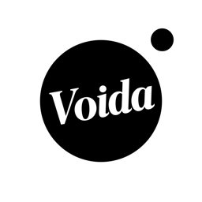

# パク ギョンソク

## iOS Engineer / フリーランス

Swift **9年2ヶ月**（うち SwiftUI **2年5ヶ月**）／ 業務委託でのフルリモート稼働歴 **8年以上**

[-pakuvision-lightgrey.svg)](https://github.com/pakuvision)

 

## 自己PR

デザイナー出身のため、**UI/UX を重視した開発**を心掛けています。
UIデザイナーからの要望に対して限りなく100%に近い実装を行うと同時に、UX面での提案・改善も積極的に行ってきました。
（アニメーション実装の一部は [GIPHY](https://giphy.com/channel/boardguy1024) にてご覧いただけます）

技術面では、**既存コードのリファクタリングやパフォーマンス改善**を得意としています。
コールバックの多重ネストで追跡困難だった動画再生ロジックを async/await で全体再設計したり、
発熱・フリーズといったパフォーマンス課題を数値で改善するなど、
「動くコード」から「保守できるコード」へ引き上げる役割を多く担ってきました。

また、前回の契約終了後の約3ヶ月間は、AIツールを活用しながら
**企画・デザイン・開発・リリースまでを一人で完遂**したアプリを3本 App Store に公開しました。

 

## 個人開発アプリ（App Store リリース中）

| | App | 概要 | 技術ポイント |
| :--: | :-- | :-- | :-- |
|  | **[Voida](https://apps.apple.com/jp/app/id6763839287)** カメラアプリ | 普段から写真撮影が好きで、サブスクで使っていたアプリを参考に自作 | **CoreML の深度推定モデル**で写真の深度を推定し、その値に応じた自然なボケ（被写界深度）を実装 |
|  | **[LAMUNE](https://apps.apple.com/jp/app/id6792246878)** フィルム加工アプリ | フィルム加工に特化し、多彩なプリセットでワンタップ加工が可能 | 画像処理パイプライン／プリセット設計、加工プレビューの最適化 |
|  | **[ilgi](https://apps.apple.com/jp/app/id6751026452)** 日記アプリ | まず手を動かすことを目的に開発したシンプルな記録アプリ | UI/UX を意識した記録体験の設計 |

いずれも 企画 → UIデザイン → 実装 → 審査対応 → リリース までを個人で担当しています。

 

## Skills

| 分類 | 内容 |
| :-- | :-- |
| **Language** | Swift（9年2ヶ月 / そのうち SwiftUI 2年5ヶ月）、C#（1年6ヶ月）、React / HTML / CSS（6ヶ月以上） |
| **UI** | UIKit（Storyboard / XIB、Storyboard不使用のコードベースUI設計の両方に対応）、Lottie、カスタムアニメーション |
| **Architecture** | MVVM、VIPER、Clean Architecture、[TCA](https://github.com/pakuVision/TCA_Sample)（実務経験なし / 公式サンプルを参照して基礎を学習） |
| **非同期・並行** | async/await、RxSwift、ReactiveSwift |
| **Apple Frameworks** | AVFoundation、CoreML、CoreData、GoogleMaps |
| **Backend / BaaS** | Firebase（Database / Auth / Storage / Crashlytics / Analytics / AppDistribution）、Apollo（GraphQL） |

 

## 職務経歴

### 2023/12 ~ 2026/4（2年5ヶ月）｜業務委託（フリーランス）｜フルリモート
**AI骨格分析によるスポーツ・ダンス動作判定サービス（iOS）**

スポーツやダンスの動作・姿勢を AI 骨格分析でマッチ度判定するサービスの新機能開発・運用・保守。
体制：iOSエンジニア4名（うち自身1名）／ iPhone・iPad 対応

**担当**
- 既存の動画再生ロジックをリファクタリング。コールバックが多くフローの追跡が困難だったため、**async/await を導入してプロジェクト全体を再設計**。可読性を向上させ、副作用に起因するバグを大幅に削減
- 動画再生時の**発熱問題を改善**
- 長時間再生後に画面を閉じると**10秒以上フリーズしていた不具合を1秒台まで改善**
- MVVMアーキテクチャに沿った新機能開発・保守・バグ対応
- クライアントとの技術的な相談対応・実現可能性の検討
- ピアレビュー

`Swift` `SwiftUI` `MVVM` `async/await` `AVFoundation` `CoreData` `Firebase Crashlytics`

---

### 2021/12 ~ 2023/10（1年11ヶ月）｜業務委託（フリーランス）｜フルリモート
**クラウドファンディングアプリ（iOS）**

**担当**
- 新機能を SwiftUI で開発
- UX / UI の改善点を提案し、画面の改修を実装
- 保守・バグ対応
- VIPER の UnitTest を実装（主に Presenter、Interactor）
- ピアレビュー

`Swift` `SwiftUI` `VIPER` `Firebase(Database/Storage/Crashlytics)` `Apollo(GraphQL)`

---

### 2020/7 ~ 2021/11（1年4ヶ月）｜業務委託（フリーランス）｜フルリモート
**ウォレットアプリ開発（iOS）**

既存アプリを刷新するプロジェクトに途中から参画。

**担当**
- 用意されたサンプルモジュールをベースに Clean Architecture で実装
- 2021年1月にリリース、以降はバグ対応および新機能開発
- プロジェクト規模に見合った構成へ見直すため、**Clean Architecture から VIPER への移行**をチームで担当（全体の約30%まで推進）
- ピアレビュー

`Swift` `Clean Architecture` `Swinject` `Lottie`

---

### 2020/1 ~ 2020/5（5ヶ月）｜業務委託（フリーランス）｜フルリモート・常駐（ハイブリッド）
**瞑想アプリ 新規開発（リリース中）**

**担当**
- UI実装、FirebaseAuth（Sign in with Apple / Facebook / Twitter / Google）、Firebase データベース通信処理
- ReactJS による Web ページ作成
- 開発進行中は Firebase App Distribution でアプリをクライアントへ提供し、テストや改善点を検証
- リリース後の新機能追加・改修対応

`Swift` `RxSwift` `MVVM` `Firebase(Auth/Database/Storage/Crashlytics/Analytics)` `Lottie` `ReactJS` `HTML/CSS`

---

### 2019/9 ~ 2019/12（4ヶ月）｜業務委託（フリーランス）
**瞑想アプリ 改修（iOS）**

他社で制作された、**ビルド不能かつ多数の不具合を抱えたアプリ**の改修を担当。

**担当**
- ビルド可能な状態へ修正
- バックグラウンド再生時の強制終了・再生不具合の修正
- **メモリリークによる強制終了をはじめ、多数のクラッシュを改修**
- ReactJS で WebView を作成しアプリへ反映
- 新機能追加

`Swift` `RxSwift` `ReactiveSwift` `MVVM` `Firebase(Auth/Database/Storage/Crashlytics/Analytics)` `Lottie` `ReactJS` `HTML/CSS`

> ※ 上記3案件（2019/9 ~ 2021/11）は同一現場での参画であり、契約期間は通算2年2ヶ月です。

---

### 2017/9 ~ 2019/4（1年5ヶ月）｜業務委託（フリーランス）
**大手チケットエンタメアプリ開発（iOS）**

**担当**
- 新規プロジェクト開発に初期から参画
- MVVM をベースに画面を実装（カスタムアニメーション、カスタムUI、API実装など）
- リリース後のバグ対応・新機能追加対応

`Swift` `RxSwift` `MVVM` `GoogleMaps` `Firebase Crashlytics` `Firebase Analytics`

---

### 2017/6 ~ 2017/8（3ヶ月）｜正社員｜社内開発
**著名人の時間を取引するアプリ開発（iOS）**

**担当**
- 新規プロジェクト開発に初期から参画
- 画面の約20%を作成（StoryView + ViewController）
- SNSログインロジック実装

`Swift` `Twitter SDK(Login)` `Facebook SDK(Login)`

 

## 稼働について

- **稼働形態**：フルリモート（業務委託）を中心に、8年以上の稼働実績があります
- **得意領域**：既存プロジェクトのリファクタリング、パフォーマンス改善、UI/UX を意識した実装、SwiftUI での新規機能開発
- **参画スタイル**：仕様の背景を理解した上で実装し、技術的な相談やUX改善の提案も併せて行います

 

## Contact

- Mail：[boardguy1024@gmail.com](mailto:boardguy1024@gmail.com)
- GitHub：[boardguy1024](https://github.com/boardguy1024) / [pakuvision](https://github.com/pakuvision)（プライベート専用）
